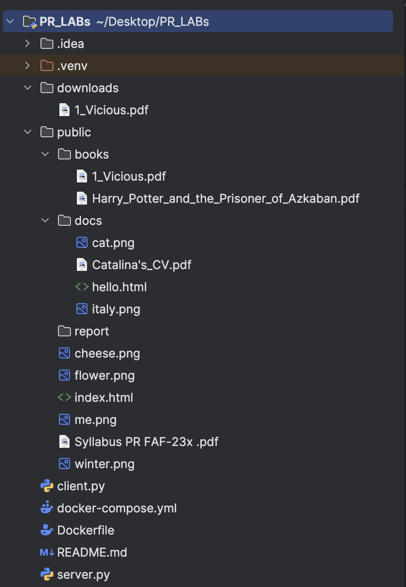
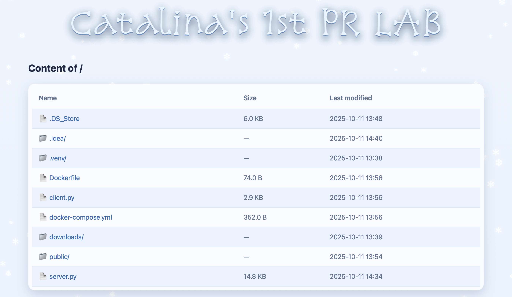

# LAB 1 PR: HTTP file server with TCP sockets
In this lab, I implemented a basic HTTP file server in Python that allows directory navigation, including access to nested folders and files.

## 1. Contents of Directory
* The root directory contains several subfolders. The *Downloads* folder is designated for files saved by the client. The *Public* directory includes additional subdirectories, along with various HTML, PNG, and PDF files used for testing. Other nested directories, such as *books* and *docs*, also include similar test files. The *Report* folder stores images utilized in this report.
* The *Dockerfile* defines the setup for both the server and client containers—specifying dependencies and instructions to run the Python applications within Docker. The *docker-compose.yml* file coordinates these containers, launching both services, linking them together, mapping ports, and managing shared storage volumes.
* The *server.py* script processes HTTP requests, locates the requested files within the directory, and sends them back to the client.
* The *client.py* script connects to the server, requests specific files, and either displays or saves the received data into the downloads folder depending on the file type.
 
    

## 2. Dockerfile
The *Dockerfile* makes sure to set a lightweight Python 3.12 environment, copies the server and client scripts into the container’s /app directory, sets it as the working directory, and exposes port 8000 so server.py/client.py can use it.
```dockerfile
FROM python:3.12-slim
WORKDIR /app
COPY server.py client.py ./
EXPOSE 8000
```

## 3. Docker compose
This *docker-compose.yml* file defines two services: a server that runs server.py on port 8000 to host files, and a client that runs client.py to connect to the server,while managing their shared volumes and ensuring the server starts before the client.

```dockerfile
services:
  server:
    build: .
    container_name: pr-web-server
    environment:
      PORT: 8000
    ports:
      - "8000:8000"
    volumes:
      - ./:/app:ro
    command: ["python", "server.py", "/app"]
  client:
      build: .
      entrypoint: [ "python", "client.py" ]
      volumes:
        - ./downloads:/app/downloads
      depends_on:
        - server
```

## 4. Running the server

We can run the project locally using the command:
```python
python3 server.py <path_to_directory>
```
The image below demonstrates how the project can be executed locally, using the root directory of the project as a command-line argument.


We can also run it using docker with the following command:
```
docker compose up server
```

## 5. Content of served directory
The HTTP server serves files from the content directory specified in the command. The content directory contains HTML, PDF, PNG files, and the contents_subfolder.
If we serve the root we will see the following files and directories in the browser. We can see all types of files, but can access only png, html, pdf files.


*Contains:*
- `index.html` – main HTML page
- `me.png` – image referenced in the HTML file
- `Syllabus PR FAF-23x.pdf` – sample PDF file
- `contents_subfolder/` – subdirectory with additional files

We can also choose to serve another directory, like *public* (as seen in the following picture). We can do this locally by running a command similar to this: ```python3 server.py public```, or with docker by changing the command line in *docker-compose.yml*.


## 6. Requesting files
* We can request a **png** file in the browser by accessing its path or by navigating to it through the folders in the listings.

  

* To request a **pdf** file we do the same as for the png file.
  

* We can also request a  **html** and we will see the html page in the browser.
  

* If we request an nonexistent file or a file with an extension  that is not permitted, we will get the 404 page. We can also click on the *homepage* button to go back to the root directory list.
  

## 7. Client
We can run the client both locally:
```python
 python3 client.py 0.0.0.0 8000 1_Vicious.pdf
```
or using docker:
```
docker compose run --rm client server 8000 1_Vicious.pdf
```
And we will get the file saved in the *downloads* folder.


## 8. Accessing the Server from Another Device (Network Test)
To simulate browsing the server from another client on the network, the setup was tested using a phone as the external client.

Since the dorm LAN uses a private network that restricts incoming connections, the laptop acted as a Wi-Fi hotspot, allowing the phone to connect to the same local network.

## 8.1 Network Setup
- Laptop: Ran the HTTP server in Terminal on port 8080.
- Phone: Connected to the laptop’s hotspot network.
- The server’s IP address was identified using the command:

```
ifconfig
```
Result :
```
IPv4 Address. . . . . . . . . . . : 192.168.100.51
```
## 8.2 Accessing from Phone
On the phone browser, the following URL was opened:

Result :
```
http://192.168.100.51:8000
```
The phone successfully accessed the server, displaying the index page and directory listing.

Screenshots:
- Server running on laptop (terminal)
  

- Successful access from phone browser (main directory), directory listing and images/PDFs loaded on the phone
  
  

- Successful access from phone browser (index.html)
  

## 9. Conclusion
The HTTP server successfully serves HTML, PNG, and PDF files, generates directory listings for subfolders, and correctly handles 404 and unsupported file types. The Python client fetches files, prints HTML pages, and saves PNG/PDF files locally. The server was also successfully accessed from another device on the local network, confirming proper network functionality.
All lab requirements are met, and the screenshots demonstrate that both the server and client work as expected.